# BMS-SMBus research

### Research goals

The primary objective of this prototype is to develop and validate a power-path and battery-management solution that can reliably power an x86 Intel CPU–based evaluation platform while providing full **Smart Battery** (**SMBus**) control. The system must support automatic switching between external input power (e.g., AC adapter) and a rechargeable battery pack, while maintaining efficient charging and continuous power delivery to the load. In parallel, the design must expose battery state (e.g., state of charge, voltage, current, temperature, charging/discharging status, and alarms) over SMBus in a manner compatible with Smart Battery conventions, enabling the host firmware/OS to present battery and charging information through **ACPI interfaces**.

The ultimate goal is to integrate this solution into a custom motherboard. The design must be capable of supplying sufficient power for an **Intel x86 CPU–based SoM** and must interface with ACPI so the operating system can report battery and charging status. To avoid the time and effort of developing a custom PCB solely for a proof of concept, the prototype is built using Texas Instruments evaluation boards along with a simple PCB used to mount the battery cells.

### Block diagram

This block diagram shows a proof-of-concept Smart Battery power subsystem for an x86 platform. A [multi-input external supply](https://github.com/lukasznowarkiewicz/MIPS-multiple-input-power-supply) sources power to the **BQ25720EVM**, which performs power-path control and battery charging; its **SYS** output then feeds a **buck converter set to 12 V**, which powers the **LattePanda MU (x86) with Lite carrier board**. The battery pack is built around the **BQ40Z50EVM-561** (fuel gauge + pack management), connected to the cell stack via the sense taps (1N/1P/2P/3P/4P) and to the charger via **PACK+ / PACK-**. The **SMBus (SMBC/SMBD)** is shared between the LattePanda, charger, and battery manager so the host can read battery/charging status (ACPI-visible) and the charger can be configured/monitored over SMBus.

### Elements of  the setup

#### 4s2p 18650 cells holder

The custom PCB is a carrier for an **18650-based 4S2P pack**: it mounts **four 18650 holders**arranged as **four series groups**, with **two cells in parallel per group**. The board provides the **high-current interconnect pads/traces** to build the 4S string, clearly marked **polarity** at each holder, and brings the pack connections out as **PACK+ / PACK-**. A small header on the edge exposes the **cell sense taps (GND, 1S, 2S, 3S, 4S)** for balancing/monitoring (e.g., connection to the Smart Battery gauge/protector), while keeping the PCB otherwise intentionally simple for the POC.

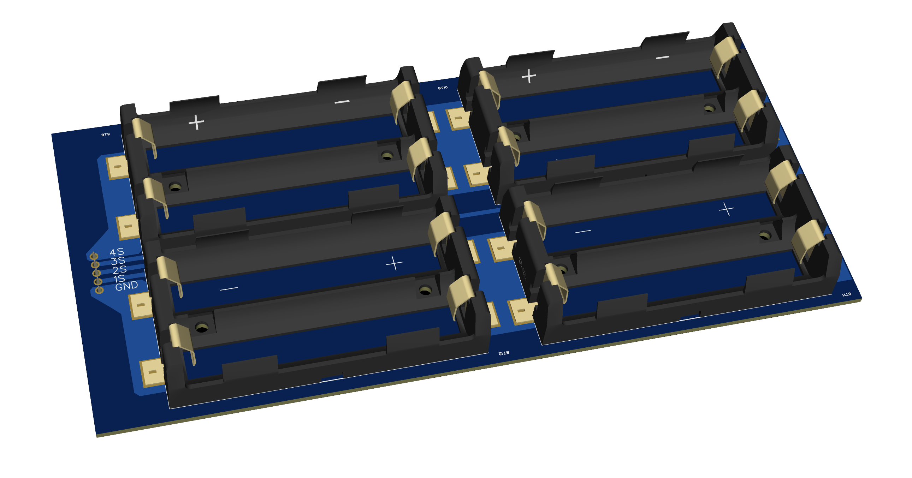

#### Battery cells 

Used: **Samsung INR18650-35E** (18650 Li-ion)  
Pack configuration: **4S2P** (8 cells total)

These cells were selected because they offer **relatively high capacity** and were widely used in **laptop battery packs** a few years ago. The **exact cell chemistry can be programmed into the fuel gauge** to improve SOC accuracy and charging behavior. The main trade-off is that the **recommended charging current is relatively modest** compared to higher-power 18650 variants.

**Key datasheet parameters (per cell):**

- **Nominal voltage:** 3.6 V
    
- **Charge termination voltage:** 4.2 V (CC/CV)
    
- **Capacity:** 3,350 mAh (min), ~3,500 mAh (typ.)
    
- **Standard / max charge current:** 1.7 A / 2.0 A
    
- **Max continuous discharge current:** 8 A
    
- **Discharge cut-off voltage:** 2.65 V
    
- **AC internal resistance:** ≤ 35 mΩ (typ. spec method)
    
- **Operating temperature:** charge 0–45 °C, discharge −10–60 °C
    

**Implications for 4S2P pack (derived):**

- **Voltage:** 14.4 V nominal, 16.8 V max (fully charged)
    
- **Capacity:** 6.7 Ah (min), ~7.0 Ah (typ.)
    
- **Energy:** ~96 Wh (min), ~101 Wh (typ.)
    
- **Theoretical continuous current (cell-limited):** up to ~16 A (2P × 8 A), before BMS/thermal limits

#### TI BQ40Z50 configuration for 4s2p 18650 based battery pack

On the photo initial test setup for configuring BQ40Z50. The **BQ40Z50EVM-561** (Smart Battery gauge/protector EVM) is wired to a **3S1P Li-ion battery pack**. The 3-series configuration is used initially because the EVM’s **default settings assume a 3S pack**. An **EV2400** interface is connected to the gauge via **SMBus** for device communication, parameter programming, and data capture (e.g., voltage/current/SOC/status). An **active electronic load** is used to simulate system discharge and validate gauge behavior under controlled load conditions. Battery charging is provided by a **laboratory bench power supply**, which is part of the setup but **not visible in the photo**.

At the very beginning, it is critical to select the correct firmware/template for the gauge in Battery Studio. If the wrong firmware is selected, many features may appear to work, but the tool can end up writing to unintended registers, resulting in unpredictable behavior and unreliable gauge operation.

To identify the correct firmware/template, initially select **any** BQ40Z50 template in Battery Studio **only to establish communication**—do not change or write any settings. Connect to the gauge and read the identification values using the **Device_number** and **FW_version** controls - example reads:

- **Device_number:** `0x0045`
    
- **FW_version:** `0x0208`

Then **restart Battery Studio** and select the template that matches the detected device/firmware version before making any modifications.

    
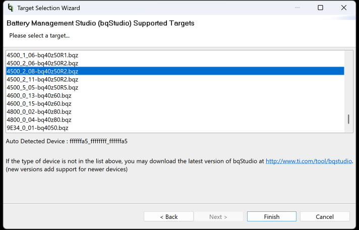

Although TI documentation recommends updating firmware first, the preferred approach here is to first verify that the device communicates correctly and behaves as expected before applying major changes—especially actions that can be difficult or impossible to reverse, such as a firmware update.

At this point should be possible to communicate with the gauge - read current state of charge, status registers and make changes in the configuration.

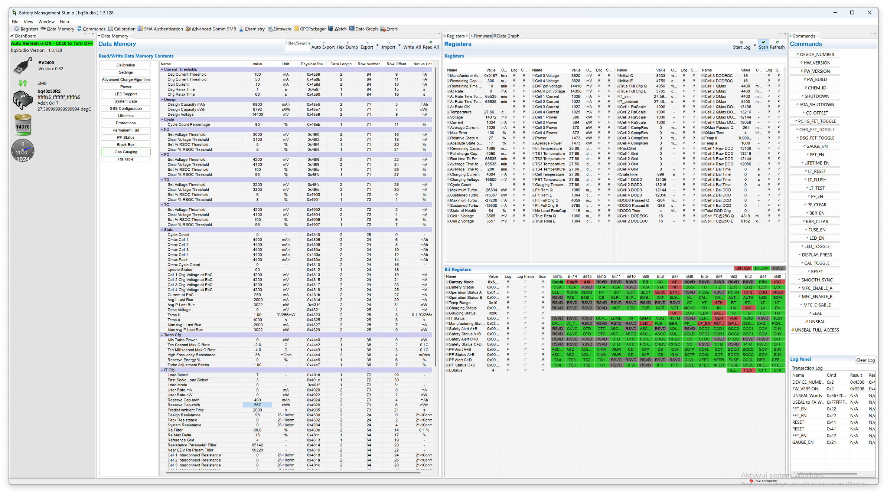

This gauge has many options, but only a few are required to get started. Personally, I miss a quick-start guide from TI that covers just the basics (or maybe I simply need more experience with simpler solutions). Nevertheless, that’s why I’m describing them here. Additionally, the config file with all the changes described below for the firmware version mentioned above is located in the folder **/config**

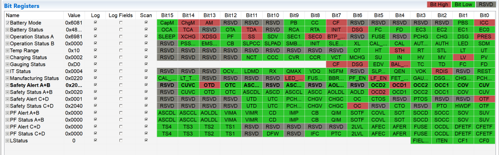

The sections below document every configuration parameter that was modified from the default BQ40Z50 setup, along with the selected value and the rationale for changing it.

**Data memory -> Settings**
-> Configuration:
	-> SBS Configuration:
		-> **BCAST**: 1b (this option is absolutely crucial to give info over SMBUS to the charger to start charing after connecting power supply - BQ25720 resets CharingCurrent after disconnecting power adapter)
	-> **LED Configuration**: LedOnNFC (full charge - remain on when fully charged), BlinkMidPt (blink mid point - add half values between LEDs with blinking), LedChg (show when charging), LedR (reset - show charge after resetting) set to 1b
	-> **DA Configuration**: CC1, CC0 set to 1b  (set battery pack to 4 series configuration)
-> AFE
	-> ZVCHG Exit Threshold: 2600 mV (exit voltage from 0V status - set based on cells datasheet)
-> Manufacturing:
	-> **Mfg Status init**: LED_EN, Fuse_EN, LF_EN, FET_EN, Gauge_EN set to 1b (those options are actually very important to let the battery pack operate after reset)

**Data memory -> Advanced charge algorithm**
	-> For Samsung two parallel INR18650-35E charge current for cycle life is around 3.4A, max charge current is 4A so those options left default (but longevity of the cells should be slightly decreased)

**Data memory -> SBS Configuration**
	-> Data
		-> Remaining AH Cap. Alarm - 700mAh
		-> Remaining WH Cap. Alarm: 980cWh
		-> Initial battery mode;
			-> CAPM: 0b (values in mAh)
			-> CHGM: 0b (Enables _ChargingVoltage()_ and _ChargingCurrent()_ broadcasts to the host and smart battery charger)
			-> CC: 1b (Internal Charge controller enable - SMBUS control over the charger
		-> Manufacture Date: 2025-11-26 (YYYY-MM-DD)
		-> Serial Number: 0001
		-> Manufacturer Name: Lukasz Nowarkiewicz
		-> Device name: industrial-tablet

**Data memory -> Protections**
	-> CUV (cell undervoltage)
		-> Threshold: 2600mV
		-> Delay: 10s
		-> Recovery: 2800mV
	-> CUVC (Cell undervoltage during charging - protecting from charging deeply discharged and potentially permamently damaged battery)
		-> Threshold: 2400mV
		-> Delay: 10s
		-> Recovery: 3000mV
	-> COV (Cell overvoltage - protecting against overcharging cells, but allowing short voltage spikes)
		-> Threshold (any) Temp: 4250 mV
		-> Delay: 2s
		-> Recovery (any) Temp: 4100 mV
		-> Latch limit: 15 (encounters required to classify it as permament error)
		-> Counter Dec Delay: 10s
		->Reset: 15 s
	-> OCC1 (Overcurrent in Charge - limit which will cut-off charging with CHG FET OFF):
		-> OCC1 Threshold: 5000mA 
		-> Delay: 5s (in the cell's datasheet is no firm limit)
	-> OCC2 
		-> OCC2 threshold: 7000mA
		-> Delay: 5s 
	-> OCC (Recovery threshold required to clear the error and return to normal operating)
		-> Recovery threshold: -200mA
		-> Recovery delay: 5s 
	-> OCD1 (overcurrent in discharge):
		-> Threshold: -12000mA
		-> Delay: 10s
	-> OCD2:
		-> Threshold: -25000mA
		-> Delay: 1s
	-> OCD (Recovery threshold required to clear the error and return to normal operation)
		-> Recovery threshold: 200mA
		-> Recovery delay: 5s
		-> Latch limit: 0s
		-> Counter Dec Delay: 10s
		-> Reset: 15s
	-> OTC (over temp charge):
		-> Threshold: 45°C
		-> Delay: 30 s
		-> Recovery: 44°C
	-> OTD (over temp discharge):
		-> Threshold: 60°C
		-> Delay: 10s
		-> Recovery: 55°C
	-> OTF (over temp FET (TS2)):
		-> Threshold: 90°C
		-> Delay:10s
		-> Recovery: 80°C 
	-> UTC (under temp charge):
		-> Threshold: 0°C
		-> Delay: 10s
		-> Recovery: 1°C
	-> UTD (under temp discharge):
		-> Threshold: -10°C
		-> Delay: 10s
		-> Recovery: -5°C
	-> HWD (Host watch dog):
		-> Delay: 10s
	-> PTO (precharge timeout - protects damaged cell pack from infinite precharge current  - can be disabled in Settings):
		-> Charge threshold: 100mA
		-> Suspend threshold: 50mA
		-> Delay: 7200s (2 hours)
		-> Reset: 500mAh
	-> CTO (Fast charge timeout - can be disabled in Settings):
		-> Charge threshold: 500mA
		-> Suspend threshold: 200mA
		-> Delay: 28800s (8 hours)
		-> Reset: 500mAh
	-> OC (overcharge - based on coulomb counting rather than voltage, recommended to disable for learning-cycle - in Settings->Enabled Protections C):
		-> Threshold: 1500mAh ("over capacity" )
		-> Recovery: 500mAh
		-> RSOC Recovery: 90%
	-> CHGV (charging voltage - applies only with SMBUS charger - with ChargingVoltage() frame - ignored by the charger; can be disable in Settings->Enabled Protections D)
	-> CHGC (charging current - similar as above - ignored ChargingCurrent() frame on SMBUS; can be disable in Settings->Enabled Protections C)
	-> PCHGC (pre-charging current, as above)

**Data memory -> Gas gauging:**
	-> Design:
		-> Design Capacity mAh: 6800mAh
		-> Design Capacity cWh: 6.8Ah * 14.4V = 97.92 Wh = 9792 cWh 
		-> Design voltage: 3.6V * 4 = 14.4V
	-> FD (Fully discharge): Defaults (could be set lower for this cells, but leaving safer margin)
	-> FC (Fully charged): Defaults
	-> TD (Terminate discharge): Defaults
	-> TC (Terminate charge): Defaults
	-> State - values "learned" during battery operating
	-> Turbo CFG:
		-> Min Turbo Power: 0
		-> Ten second Max C Rate: -2.0 C (single cell is rated for 1.0C discharge)
		-> Ten milisecond max C Rate:  -4.0 C (single cell max continous discharge is 8A ~ 8/3.4 = 2.35C, so 4 C for two in parallel is with big margin)
		-> High frequency Resistance - 0 mOhm (not known at this point)
		-> Reserve Energy %: 20% (do not enable turbo mode when battery charge falls below 20%)
		-> Turbo Adjustment factor: Default
	-> IT Cfg (impedance track algorithm configuration):
		-> Reserve Cap-mAh: 400mAh (hidden from the user capacity left in the battery pack - around 5%)
		-> Reserve Cap-cWh: 567cWh (as above - around 5%)
	Rest - default
	
Additionally battery chemistry was set to Samsung INR18650-35E. With all those settings applied and flashed into gauge should be possible to charge and discharge the battery without triggering any protections. 

### TI BQ25720 charger configuration for 4s2p 18650 based battery pack

As a next step in building the Smart Battery prototype, the laboratory power supply was replaced with the **BQ25720EVM**. In this setup, the BQ25720EVM manages the **power path**—controlling current flow from the external source to the load—and, when sufficient input power is available, it also **charges the battery**.

Battery Studio is used again to configure and monitor the **BQ25720EVM** over **SMBus**, in the same way as for the gauge. Note that **BQ40Z50** is also connected to that bus, as it can act in multi master network and send control commands to the charger.
 
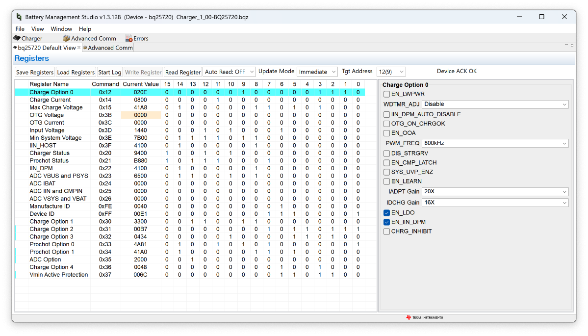

Configuration file after all changes located in **/config** directory. Changes made and rationale:

**Registers -> Charge Option 0

-> **EN_LWPWR (Enable Low Power): 0b (unchecked)**
	-> Low-power mode is not enabled to keep full-featured, predictable charger behavior.

-> **WDTMR_ADJ (Watchdog Timer Adjust): Disable**
	-> Disables the SMBus watchdog so charging does not stop if the host is not periodically refreshing charge commands.

-> **IIN_DPM_AUTO_DISABLE (Input Current DPM Auto Disable): 0b (unchecked)**
	-> Automatic disabling of input current DPM is not enabled

-> **OTG_ON_CHRGOK (OTG On Charge OK): 0b (unchecked)**
	-> OTG is not required there - so intentionally disabling it

-> **EN_OOA (Enable Out Of Audio): 0b (unchecked)**
	-> Out-of-audio mode is not enabled here, leaving baseline switching behavior unless audible noise becomes a confirmed issue.

-> **PWM_FREQ (PWM Frequency Select): 800kHz**
	-> Sets the switching frequency selection to 800kHz as it was default for the eval board and chosen coil.

-> **DIS_STRGRV (Disable STRGRV): 0b (unchecked)**
	-> STRGRV-related behavior is not disabled, keeping default platform/eval-board strap behavior intact.

-> **EN_CMP_LATCH (Enable Comparator Latch): 0b (unchecked)**
	-> Comparator latch is not enabled to avoid sticky fault/limit behavior while validating thresholds and system interactions.

-> **SYS_UVP_ENZ (System Under Voltage Protection Enable Z): 0b (unchecked)**
	-> This optional system UVP path is not enabled via ChargeOption0, relying on standard NVDC and VSYS_MIN handling first.

-> **EN_LEARN (Enable Learn Mode): 0b (unchecked)**
	-> Learn mode is not enabled to keep normal operating behavior; consistent with a stable OS/ACPI-facing battery system.

-> **IADPT_GAIN (Input Adapter Current Gain): 20X**
	-> Adapter current monitor gain set to 20X to match expected sense scaling on the evaluation hardware.

-> **IDCHG_GAIN (Battery/Charge Current Gain): 16X**
	-> Battery current monitor gain set to 16X to align current telemetry/limits with the board’s sense path.

-> **EN_LDO (Enable LDO Mode): 1b (checked)**
	-> Enables LDO/precharge-related behavior when VBAT is below VSYS_MIN, supporting safer recovery from deep discharge and complementing the gauge-side undervoltage protections.

-> **EN_IIN_DPM (Enable Input Current DPM): 1b (checked)**
	-> Enables input current DPM to protect the adapter and prevent input collapse during x86 load transients; fits the SMBus-coordinated architecture you enabled on the BQ40Z50 (internal charge control and charging broadcasts).

-> **CHRG_INHIBIT (Charge Inhibit): 0b (unchecked)**
	-> Charging is allowed, enabling normal SMBus-controlled operation and OS-visible charging state.

**Registers -> Charge Current (0x14): ChargeCurrent()**

-> **Charge Current Limit: 4928 mA**
	-> Sets the fast-charge current limit/request for the charger.
	-> Value is set just under **5 A**, aligning with pack-side safety configuration:
		-> **BQ40Z50 OCC1 (Overcurrent in Charge) threshold: 5000 mA**
	-> Worth noting this settings is not persistent - it resets after each charger disconnect event. This should be set by the gauge - send over SMBus.

**Registers -> Max Charge Voltage (0x15): MaxChargeVoltage()**

-> **Charge Voltage Limit: 16808 mV**
	-> Sets CV target for a **4S** pack.
	-> 16808 mV / 4 ≈ **4202 mV/cell**, matching standard 4.20 V/cell charging.
	-> Stays below **BQ40Z50 COV = 4250 mV**, minimizing overvoltage trips.

**Registers -> Input Voltage (0x3D): InputVoltage()**

-> **Input Voltage Limit: 4544 mV**
	-> Sets the input voltage DPM threshold (VINDPM).
	-> Arbitrary limited to 5V input source

**Registers -> Min System Voltage (0x3E): MinSystemVoltage()**

-> **Minimum System Voltage Limit: 12300 mV**
	-> Programs **VSYS_MIN** (NVDC target floor); charger regulates SYS to ≥12.3 V via buck/boost action.
	-> Below this threshold the device prioritizes system regulation (reduces charge current and draws supplemental current from the pack as needed).
	-> Provides headroom for 4S rails under transient CPU loads and coordinates with the gauge’s UV protections to avoid SYS droop-induced resets.

**Registers -> IIN_HOST (0x3F): IIN_HOST()**

-> **Host-Programmed Input Current Limit: 4950 mA (placeholder)**
	-> Sets the input current ceiling used by the IIN_DPM loop.
	-> Should be **updated dynamically on USB-C/PD attach** based on the negotiated power contract; do not hard-code.
	-> For now set to 4950 mA as USB C charger on MIPS is set to negotiate only 20V 5A of current

With configuration as above was possible to charge the battery and power the active load on output. Additionally checked commands sent from gauge to the charge over SMBus using logic analyzer. After decoding those were:

1. **RSOC** → **25%**.     
2. **Temperature** → **299.6 K ≈ 26.5 °C**. 
3. **Voltage** → **14757 mV (14.757 V)**. 
4. **Current** → **+3022 mA**. 
5. **RSOC** again → **25%**. 
6. **SOH** → **64%**. 
7. **MAC request** → **OperationStatus (0x0054)**. 
8. **MAC response** → **OperationStatus = 0x00000187**. 
    9-10. Repeat of 7-8.

### Charging and discharging testing

The near-final end-to-end setup combines a **96 W USB-C PD charger** as the input source, the **multi-input power supply (MIPS)** for power negotiation/conditioning, the **BQ25720** charger and power-path controller, the **BQ40Z50** Smart Battery gauge, and an **active electronic load** to emulate system consumption. This configuration was used to validate two key limits under realistic conditions: the achievable **battery charge current** and the **maximum sustainable power draw**deliverable to the load.

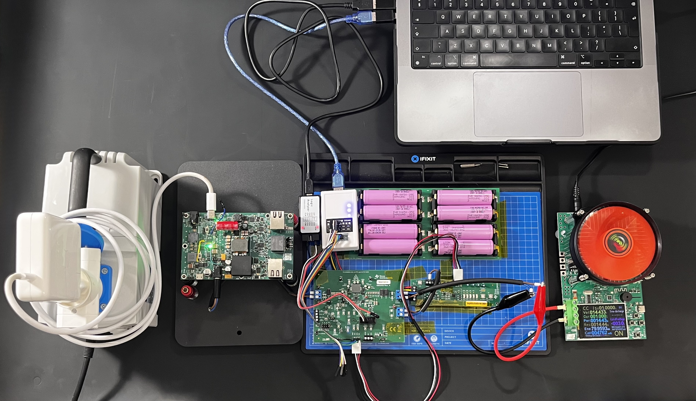

### Lattepanda MU SOM in Lite carrier with SMBus connectivity

The final setup represents the complete Smart Battery power chain operating with the **real x86 load** instead of an artificial electronic load.

- **Input power:** A **96 W USB-C PD charger** provides the primary external source. It feeds the **MIPS (multi-input power supply)** stage, which handles input selection/negotiation and presents a stable upstream rail to the charger/power-path stage.
    
- **Power-path and charging:** The **BQ25720EVM** is connected downstream of the MIPS and acts as the central **power-path controller and battery charger**. It regulates current flow from the external source to the system rail and, when headroom is available, allocates current to **charge the battery** while maintaining system power.
    
- **Battery pack and gauging:** The battery pack (cells + harness) is managed by the **BQ40Z50EVM-561**, which performs **fuel gauging and pack management** and exposes Smart Battery–style telemetry and status over **SMBus**. The BQ40Z50EVM connects to the pack via **cell sense taps** and to the power-path via **PACK+ / PACK-**.
    
- **System rail conversion:** The BQ25720 “SYS” output feeds a **buck converter configured for 12 V**, providing a system-representative regulated rail.
    
- **Target platform load:** The buck converter output powers the **LattePanda MU (Intel x86 SoM) on the Lite carrier board**. The carrier board has **SMBus lines soldered in**, allowing the host platform to communicate directly with both:
    
    - the **BQ40Z50** (battery state-of-charge, voltage/current, temperature, alarms/status), and
        
    - the **BQ25720** (charging state, input limits, system/charge currents, and power-path behavior).
        
- **Purpose of this final step:** This configuration validates end-to-end behavior under **real x86 operating conditions**, including source switching, stable delivery of peak load power through the 12 V rail, correct charging behavior when input power is available, and **host-visible battery/charging reporting** via SMBus (supporting ACPI-level integration on the platform side).

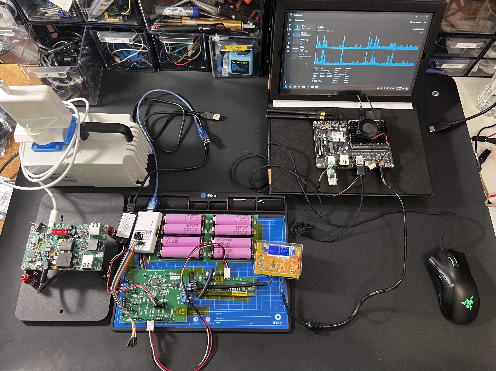

Electrically, the complete setup behaved as intended: the platform can be powered from the external source or the battery, the **power-path switching works**, the battery can be **charged and discharged** under realistic load, and both the **BQ25720** and **BQ40Z50** communicate correctly over **SMBus**.

Connecting SMBus to the Lattepanda MU on the other hand required soldering additional wires to the lite carrier SDRAM receptacle. 

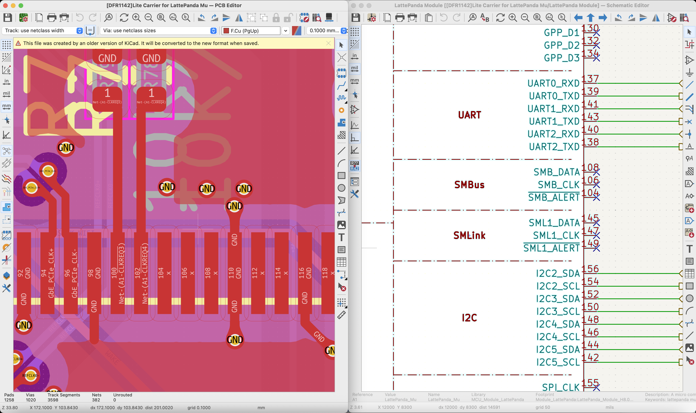

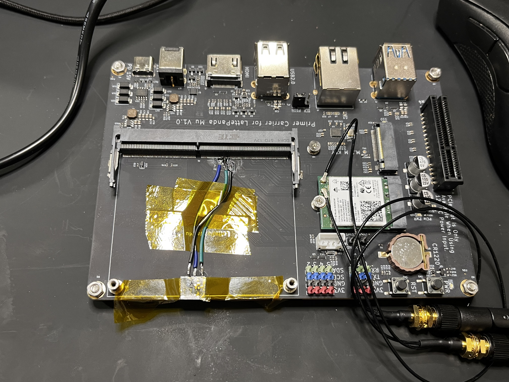

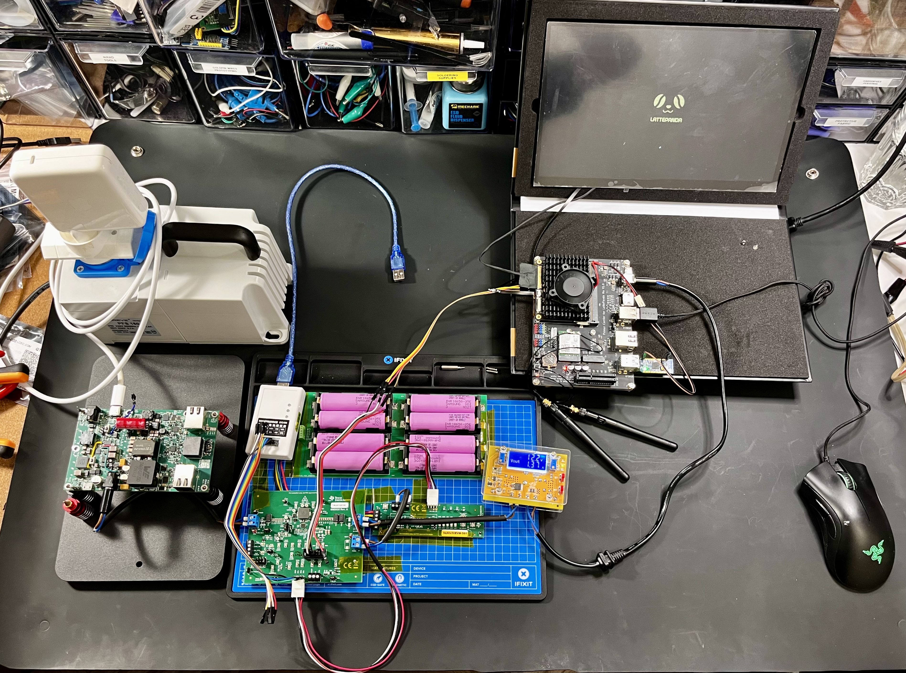

Unfortunately found that the remaining gap is on the host side: the **LattePanda MU BIOS/UEFI does not implement Smart Battery / ACPI battery support**, so the operating system cannot natively expose battery and charging status despite the SMBus data being available. Implementing this would require significant firmware work—potentially building a custom UEFI using frameworks such as **TianoCore EDK II**—which is substantial effort and ramp-up. For now, the pragmatic approach is to open an issue in the LattePanda GitHub repository and wait for the manufacturer to add Smart Battery support in their firmware.

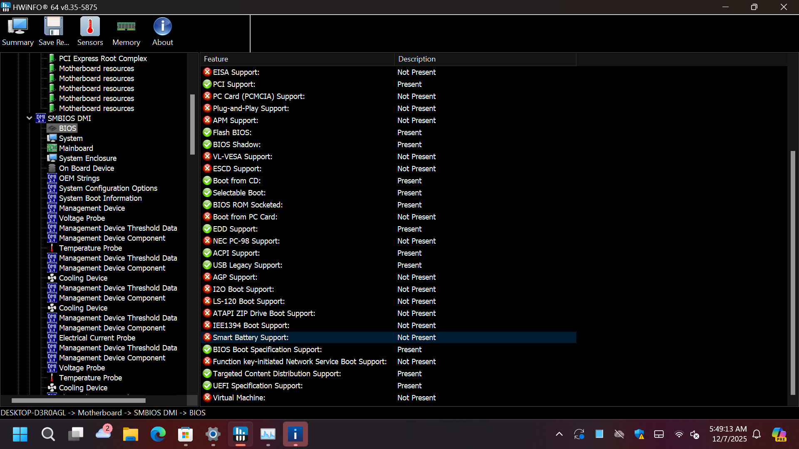

### Summary

In summary, the POC validates the complete power chain: USB-C PD (via MIPS) feeding the **BQ25720** for power-path control and charging, with the **BQ40Z50** managing the pack and reporting over **SMBus**. After configuration the setup proved stable power delivery and confirmed practical limits for **charge current** and **maximum sustainable load power**. Unfortunately, the Smart Battery/SMBus work is currently blocked by the lack of **firmware (BIOS/UEFI) support** on the intended compute module, which prevents ACPI from exposing battery and charging status to the operating system. This limitation will be addressed in a future iteration—either by implementing the required functionality in a **custom UEFI** (e.g., based on TianoCore EDK II) or by switching to a compute module with declared Smart Battery support, such as the **conga-SA8 SMARC module from congatec**, which advertises Smart Battery/ACPI compatibility.

### Technical references

- **Autonomous Smart Battery Guide (SLUAAF8)** — high-level reference for Smart Battery (gauge + charger over SMBus) system behavior. ([Texas Instruments](https://www.ti.com/lit/SLUAAF8?utm_source=chatgpt.com "Autonomous Smart Battery Guide"))
    
- **BQ40Z50 datasheet** — gauge/pack manager electrical + SMBus feature reference. ([Texas Instruments](https://www.ti.com/lit/ds/symlink/bq40z50.pdf?utm_source=chatgpt.com "bq40z50.pdf"))

- **bq40z50-R2 Technical Reference Manual (SLUUBK0B)** — primary reference for **commands/registers, ManufacturerAccess, Data Memory**, and other low-level details used in bqStudio when configuring/debugging the **BQ40Z50**. ([Texas Instruments](https://www.ti.com/lit/ug/sluubk0b/sluubk0b.pdf?ts=1765616620785](https://www.ti.com/lit/ug/sluubk0b/sluubk0b.pdf?ts=1765616620785)))

- **bq40z50EVM-561 User’s Guide (SLUUAV7)** — EVM wiring, jumpers and evaluation. ([Texas Instruments](https://www.ti.com/lit/pdf/sluuav7?utm_source=chatgpt.com "bq40z50EVM Li-Ion Battery Pack Manager Evaluation ..."))
    
- **BQ25720 datasheet** — charger + power-path controller operating modes and SMBus registers. ([Texas Instruments](https://www.ti.com/lit/ds/symlink/bq25720.pdf?utm_source=chatgpt.com "BQ25720 SMBus 1- to 4-Cell Narrow VDC Buck-Boost ..."))
    
- **BQ25720/BQ25723 EVM User’s Guide (SLUUC74)** — EVM setup and test procedure. ([Mouser Electronics](https://www.mouser.com/datasheet/2/405/1/sluuc74_pdf_3fts_3d1685141625382_26ref_url_3dhttps-2449778.pdf?srsltid=AfmBOoq9-USj-D4rPJs-dgR_hpdKNwg2arCLzBm6L-WyaqscAayjTNDB&utm_source=chatgpt.com "BQ25720, BQ25723 Evaluation Module"))
    
- **bqStudio (BQSTUDIO)** — main PC tool used to configure/monitor both the gauge and the charger. ([Texas Instruments](https://www.ti.com/tool/BQSTUDIO?utm_source=chatgpt.com "BQSTUDIO Application software & framework"))
    
- **Smart Battery Data Specification 1.1** — command set/data model the host/OS expects for “Smart Battery”. ([SBS Forum](https://sbs-forum.org/specs/sbdat110.pdf?utm_source=chatgpt.com "Smart Battery Data Specification"))
    
- **Smart Battery Charger Specification 1.1** — charger-side SBS expectations and behaviors. ([SBS Forum](https://sbs-forum.org/specs/sbc110.pdf?utm_source=chatgpt.com "Smart Battery Charger Specification"))
    
- **SMBus Specification (v3.3)** — electrical/protocol baseline for reliable bus operation (timing, addressing, PEC, etc.). ([SMBus](https://smbus.org/specs/SMBus_3_3_20240512.pdf?utm_source=chatgpt.com "System Management Bus(SMBus)Specification"))
    
- **ACPI spec (Smart Battery + SMBus interface sections)** — what BIOS/UEFI must expose so the OS can show battery/charging status. ([UEFI Forum](https://uefi.org/htmlspecs/ACPI_Spec_6_4_html/?utm_source=chatgpt.com "ACPI Specification 6.4 documentation"))
    